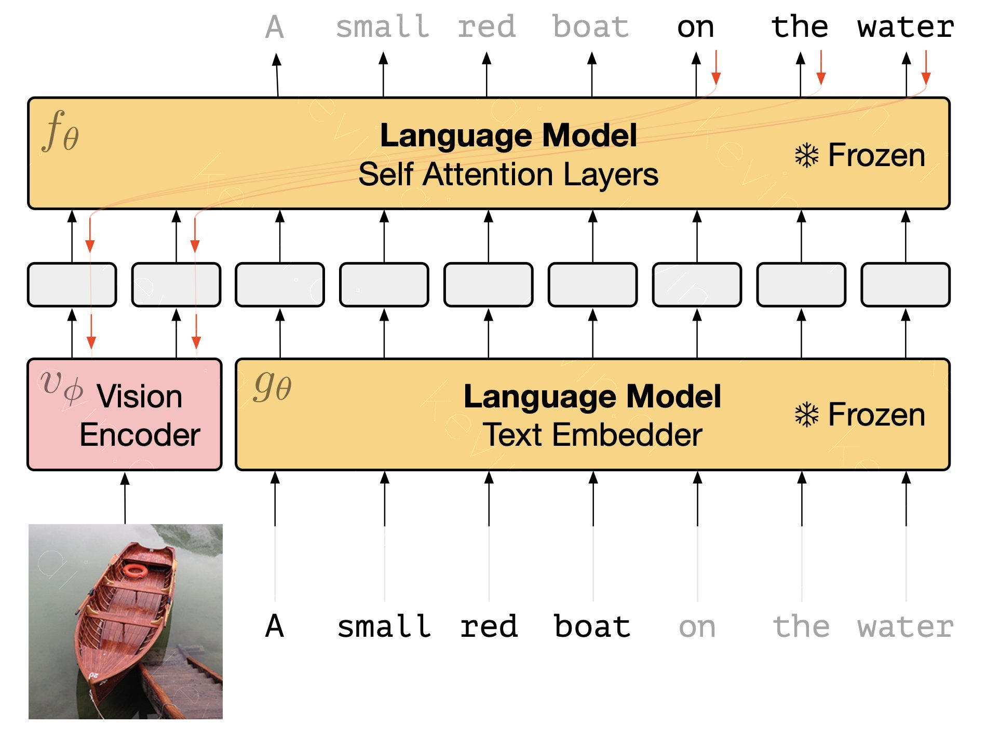

# FROZEN
Unofficial Multi-Modal model : [FROZEN](https://deepmind.com/research/publications/2021/Multimodal-Few-Shot-Learning-with-Frozen-Language-Models) implementation repository published by Google DeepMind.



## Paper
https://arxiv.org/abs/2106.13884

## Model 
```python
from frozen.models import FrozenModel

frozen = FrozenModel.from_pretrained("gpt2")
output = frozen(mok_img, mok_tokens)
```

## Supported Huggingface Models(NLP)
1. GPT2
2. GPT-Neo
3. GPT-J

## DATASET
Dataset preprocessing code is refered from [ViLT](https://github.com/dandelin/ViLT/tree/master/vilt/utils) Repository.

## Prepare Datasets
* Most of process is same as [ViLT Repository](https://github.com/dandelin/ViLT/blob/master/DATA.md)
### Step1. Download Task-specific datasets
1. Coco Dataset
    ```bash
    bash script/coco_download.sh
    ```

2. VqaV2 Dataset
    ```bash
    bash script/vqav2_download.sh
    ```
### Step2. Making Arrow dataset.
* See [prepare_datasets.py](./prepare_dataset.py)
```python
from frozen.utils.write_coco_karpathy import make_arrow
make_arrow("./dataset/coco/", "./dataset/coco/arrows/")
```

## Training
* Using Script File
```bash
bash script/train.sh
```
* Using Commands
```bash
python train.py with data_root=$ARROW_DATA_PATH num_gpus=$N_GPUS num_nodes=$NUM_NODES $TASK_NAME per_gpu_batchsize=$BATCH_SIZE load_path="$CKPT_PATH"
```
